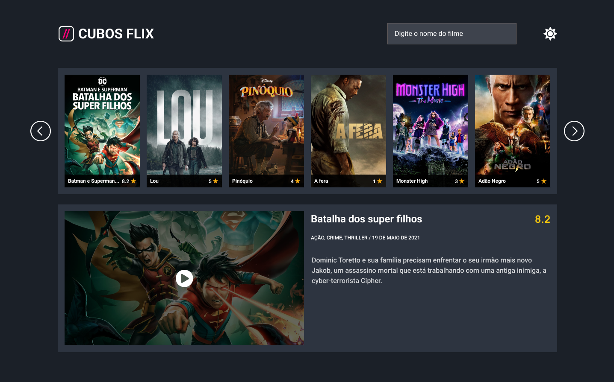

<h1 align="center"> Cubos Flix </h1>

Aplicativo para um serviço de streaming.

  <a href="#-tecnologias">Tecnologias</a>&nbsp;&nbsp;&nbsp;|&nbsp;&nbsp;&nbsp;
  <a href="#-projeto">Projeto</a>&nbsp;&nbsp;&nbsp;|&nbsp;&nbsp;&nbsp;
  <a href="#-layout">Layout</a>&nbsp;&nbsp;&nbsp;

 

  

## 🚀 Tecnologias

Esse projeto foi desenvolvido com as seguintes tecnologias:

- HTML e CSS
- JavaScript
- Git e Github

## 💻 Projeto

Página web para um serviço de streaming. Nesta aplicação consta as seguintes funcionalidades são:

- Visualização de filmes
- Paginação de filmes
- Busca de filmes
- "Filme do dia"
- Modal de filme
- Mudança de tema

## 🔖 Layout

Você pode visualizar o layout do projeto através [DESSE LINK](https://www.figma.com/file/CLrsT8zY1Tfr53dinLljMu/Desafio-M%C3%B3dulo-2----2.0?node-id=0%3A1). É necessário ter conta no [Figma](https://figma.com) para acessá-lo.